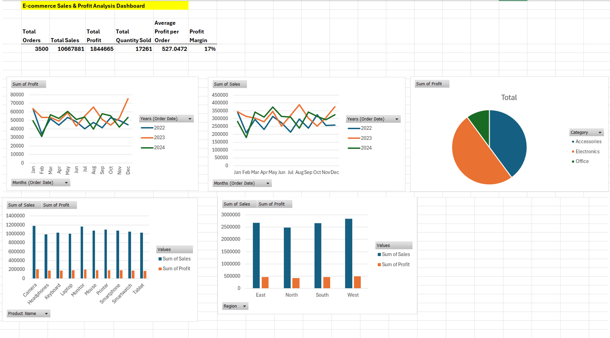

# 📊 E-commerce Sales Analysis Dashboard

## 📌 Project Overview
This project analyzes e-commerce sales data using Excel, focusing on identifying trends, patterns, and actionable business insights.

---

## 📊 Dashboard Preview

---

## 📊 Key Metrics
- Total Orders: 3,500  
- Total Sales: 10,667,881  
- Total Profit: 1,844,665  
- Profit Margin: 17%  
- Average Profit per Order: 527  

---

## 📈 Analysis Performed
- Monthly Sales Trends (2022–2024)
- Profit Analysis
- Sales by Category and Region
- Product Performance

---

## 🔍 Key Insights
- Growth peaked in 2023 but slowed in 2024  
- Electronics is the main revenue driver  
- Strong seasonality patterns  
- High sales ≠ high profitability  

---

## 💡 Recommendations
- Increase investment in Electronics  
- Improve margins on top-selling products  
- Optimize underperforming categories  
- Align strategy with seasonal demand  

---

## 🛠 Tools Used
- Microsoft Excel  
- Pivot Tables  
- Data Analysis  
- Dashboard Design  
